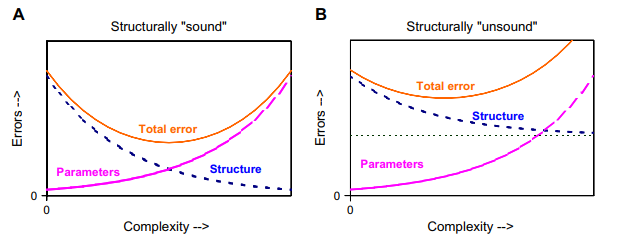

# Literature

[Hydrological models are so good, do we still need data?
](data_for_models.pdf)

1. Author argues for increased efforts on hyrdological monitoring despite advacns in modelling.
2. There is a good summary on the history of hydrological modelling. From electric circuit analogues to latest mathematical models.
3. "Modellers who focus on models without continual reference to real data are not really scientists bu artists"
4. Summary of types of modelling: Deterministic-Stochasic-MonteCarlo | Conceptual-Empirical-Physical.
5. Good illustration on Model uncertainity
