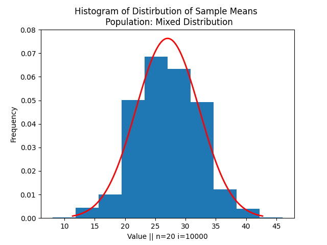

# Central Limit Theorem

Even if the population is not normal, distribution of sample means is normal. (can be considered the same for distribution of sample variance, sample sum etc)

Generally considered when n>30; but works sometimes for lesser n also - especially when population is normal.

Once the sampling distribution is normal - you can use z-stat to calculate confidence interval.

If the sample size is very small - sample distribuution may not converge soon to a normal distribution. So we use t-distribution in these cases.

One of the assumptions of CLT is IID - Independent and Identical Distributions.

It means that
- Samples drawn should be independent of each other 
- All items in the sample should be drawn from the same distribution

Even though the above assumptions fail,  CLT may work - but cannot be guaranteed. Have a look at the following image. I took a population which is a combination of two different distributions `clt_iid.py`. Taking samples from this population means that items of each sample could belong to different distributions. This led to some fat tail:

The extreme cases in the sample distribution a little more probability than the normal curve. (This detail is very minute in the image shared - but there are a few reallife cases were this is significant - Taleb!)

## CLT is not the LAW

### Taleb Tribute

[Taleb's explanation of Fat tail risks](https://www.youtube.com/watch?v=PRywLLj9v_4)

Fat tails exist in pandemics, wars, financial markets.

### German Tank problem
One can think that why can't I solve the German Tank problem using CLT. It's a simple t Confidence Interval problem, right?

But in German Tank Problem, you are trying to estimate the population maximum using sample maximum. Is CLT applicable here?

CLT is thus not applicable.

The estimators that you derive using this assumption are not precise. Read the [example](https://stats.stackexchange.com/questions/69744/why-at-all-consider-sampling-without-replacement-in-a-practical-application) to know why. So if you want a very precise estimate, you have to consider sampling without replacement. Which means, you cannot use CLT. [So German Tank Problem was solved differently](https://www.youtube.com/watch?v=quV-MCB8Ozs) 

## What to do when CLT fails?

We have seen two cases above where CLT fails. Then how can we build Confidence Intervals or do Hypothesis testing?

We use inequalities to set bounds.

This inequality helps in lower bounding the quantity, which is hard to compute without CLT assumption.

Or you can derive the expected value like in the German Tank problem.

## Blogs:
1. [Beware of fat tails](https://dsaikrishna.wordpress.com/2021/06/06/beware-of-fat-tails/)