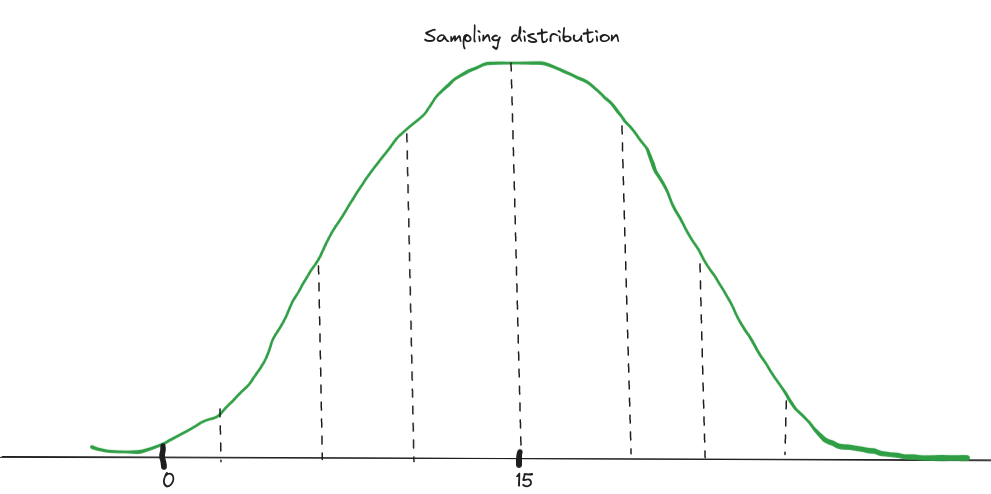
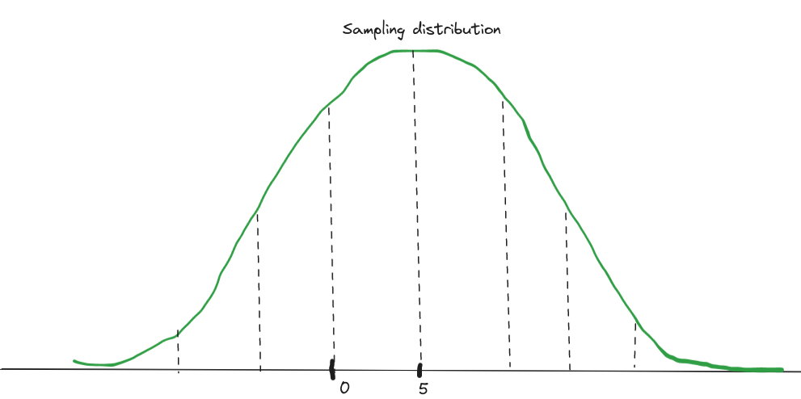
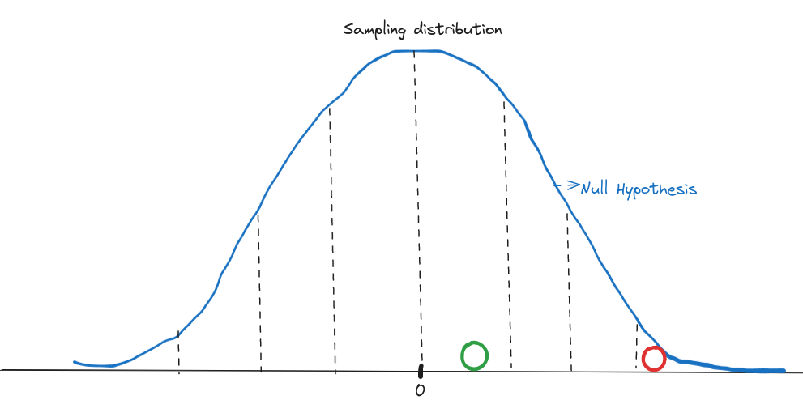
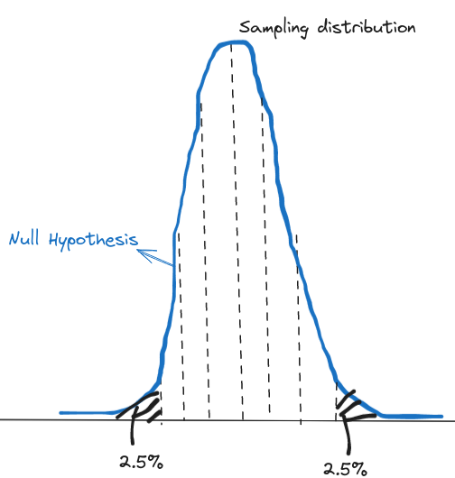
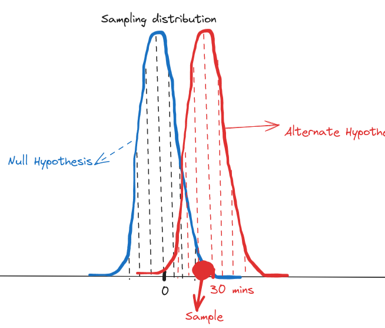

# Hypothesis Testing

You conducted one experiment and saw that Drug A helps patients recover 15 hours faster than Drug B. This becomes your hypothesis.

**Hypothesis**: Drug A helps patients recover faster than Drug B.

To test the hypothesis, you should do experiments.

Say you perform the experiment 1000 times. 
1. Collect a random sample from the population
2. Split the sample into two groups randomly. Give Drug A to one group and drug B to another. Measure how fast each group is recovering.
3. Subtract these two measurements to find - how fast is Drug A in recovering patients.
4. Store results.

As per the Central Limit Theorem, these results will be distributed normally. This means, there would be differences in magnitude of the effect. In one experiment Drug A would help recover in 10 hours; 20 hours in another. Only that based on the sample size, your shape of the bell curve might vary (thin if sample size is more).

Say 95% of these results validate your hypothesis. That Drug A helped in recovering faster.  Then `you fail to reject the hypothesis`

But if you don't get favorable results (Drug A is worse in many experiments), you can happily `reject the hypothesis`. Drug A is not helping patients recover faster.

But you cannot do multiple experiments in real life. [India's expenditure on RnD is among the lowest in the world.](https://economictimes.indiatimes.com/news/india/indias-rd-spends-amongst-the-lowest-in-the-world-niti-aayog-study/articleshow/93024586.cms?from=mdr). You don't have enough money to conduct many experiments. And hence, you take help of Statistics. Because, [Indians are good at math](https://www.hindustantimes.com/india-news/indians-are-so-good-at-mathematics-and-physics-when-stephen-hawking-came-to-india/story-qeRRbpPJK15LCHsNEKWiLK.html).

We define something called **Null Hypothesis** -- that there is no difference between Drugs A and B.

And if 95% of experiments give me the opposite result, I can reject the Null Hypothesis. Then, A is different than B. But, here comes the statistics, I need not do multiple experiments. I will just perform one experiment and see where the result falls in the sampling distribution, considering my Null Hypothesis is true.

If the experiment result falls close to the mean of the sampling distribution, then I cannot reject the null hypothesis.

If the experiment result falls 3 standard deviations away from the mean, then as per the empirical rule of bell curve, there is less than 1% chance of this sample belonging to the sampling distribution. The sample is probably coming from some other distribution. Which means, I can reject the null hypothesis with 99% confidence. I reject that there is no difference between Drugs A and B. 

We calculate p Value to test the null hypothesis. Typically, we reject the Null Hypothesis if p < 0.05 (95% Confidence)
## p-Value

Why do we take p-Value of 0.05 as a threshold? Because, generally speaking, our null hypothesis is that Drugs A and B are same. So we are interested in the extremes on both ends. +/- 2 (or) 3 standard deviations and beyond. So we calculate the probability that the experimetn sample falls in either extremes (2.5% + 2.5%)

**Definition:** "Probability of getting values equal or more extreme than the experiment value, **given the null hypothesis is true**" 

**Other ways of interpreting p-value:**

1. "How many % of experiments differ only by random things".

If `p=0.9`, 90% of experiments differ only by random things. So there is no difference in the intervention. 

2. "How many times are you willing for false positives?" (Type-1 Error)

If `p=0.05`, it can still mean that the sample belongs to the Null-Hypothesis. It's extreme, but still possible. By rejecting the null hypothesis (that Drugs A = B), I'm telling that I'm ready to accept 5% false positives. That means, 5% of the times, I may say Drugs A and B are different, even if they are the same.

### p-Hacking

Say I'm a Homeopathic doctor who wants to prove that my Homeopathic pill works. Instead of doing science, I can abuse the above false positive mechanism to prove this.

So, you know what I can do?

I'll do 100 experiments (but I won't share with you all those 100 results). Considering my null hypothesis is true (That the Homeopathic pill doesn't work), there will be about 5 results which fall outside 2 standard deviations from the mean. I'll cherry pick these experiments (the p-value will be less than 0.05) and then proclaim that my Homeopathic pill works.

I just p-Hacked the result.

**!!Multiple Testing Problem!!**

"Torture the data until it confesses" - Mancur Olson, The  Logic of Collective Action

`False Discovery Rate` and `Power Analysis` are performed to overcome p-Hacking.

Hence research is supposed to be peer-reviewed. So that the scientific community can reanalyse the data or even re-do the experiment - to ensure that p-Hacking is not done. (among many other fraudulent practices)

## Practical significance. 
Say you are not a fraud, so you diligently invented a new medicine that performs better than the existing medicine. You experimented this drug on a huge group and collected results. And you see a p-Value of 0.04! You're happy and probably started to rehearse your nobel prize speech.

That happiness could be short lived, when there is no practical significance of your discovery.

So what happened?

Remember that as per the Central Limit Theorem, the bell curve of the sampling distribution depends on the sample size? 

$\sigma_s = \sigma/{\sqrt{n}}$

$\sigma_s$ -- Standard deviation of sampling distribution  
$\sigma$ -- Standard deviation of population  
n -- Sample size

So, the bigger the sample size, the thinner will be the bell curve.

So, when the sample size is large, the null hypothesis will have a very thin sampling distribution. So thin, that, say, even if your experiment result says that your drug only recovers patients by 20 minutes faster, this result would still fall outside the 2SDs of the Null Hypothesis.

Your experiment is still statistically valid. But just don't expect a nobel prize for it. 

p-Value only tells you about statistical significance. It won't tell you about the practical significance. It won't tell you anything about how your discovery or invention can impact people.

With high sample sizes you can easily achieve statistical significance. But isn't it good to have high sample sizes? Depends. 

So it is ideal that you work backwards.

1. Note down your target. How much faster should your drug recover a patient so that you can win a Nobel Prize? This is called the `Effect Size`. There are several ways to calcluate Effect Size (Cohen's d; Odds Ratio; Risk Ratio)[4]
2. Perform Power Analysis to calculate optimum Sample Size required.
3. Perform the experiment with this sample size.
4. Now find out the p-Value. 

If the p-Value now calculated is less than 0.05, then your experiment is not only statistically significant, but also practically. Because, you considered effect size when designing your experiment. Now, you can rehearse your nobel prize speech!

## Reference
1. [StatQuest - Hypothesis Testing](https://www.youtube.com/watch?v=0oc49DyA3hU)
2. [StatQuest- interpretation of p Value](https://www.youtube.com/watch?v=vemZtEM63GY)
3. [StatQuest - calculation of p Values](https://www.youtube.com/watch?v=JQc3yx0-Q9E)
4. [Using Effect Size—or Why the P Value Is Not Enough](https://www.ncbi.nlm.nih.gov/pmc/articles/PMC3444174/)
5. [p-Hacking | TED-Ed](https://www.youtube.com/watch?v=i60wwZDA1CI)