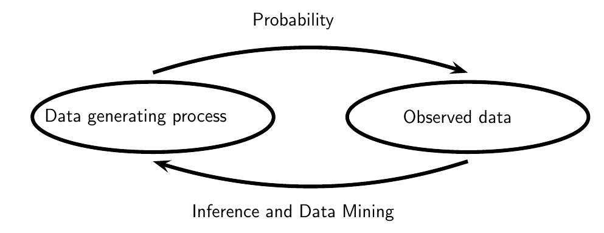

# Stats

Illuminating the world with statistical science.

"The numbers have no way of speaking for themselves. We speak for them. We imbue them with meaning" - Nate Silver.

"Using fancy tools like neural nets, boosting and support vector machines without understanding basic statistics is like doing brain surgery before knowing how to use a band-aid" -- Larry Wassrerman 

## 4 Types of Stats


The basic problem that we study in probability is:

```
Given a data generating process, what are the properties of the out-comes?
```

The basic problem of statistical inference is the inverse of
probability:
```
Given the outcomes, what can we say about the process that generated the data?
```

1. Descriptive Stats (What has happened?) -- Summary Measures and Visuals
2. Diagnostic Stats (Why it has happened?) -- Inferential Stats / Data Analysis
3. Predictive Stats (What will happen?) -- Part of Inferential Stats
4. Prescriptive Stats (What should be done? Actionable Recommendations)


## Reading order
1. Expected Value
2. Confidence Interval
3. CLT
4. t-Statistics


## References:
1. [Improving your Statistical Inferences](https://lakens.github.io/statistical_inferences/)
2. [20% Statistician](http://daniellakens.blogspot.com/)
3. All of Statistics by Larry Wasserman