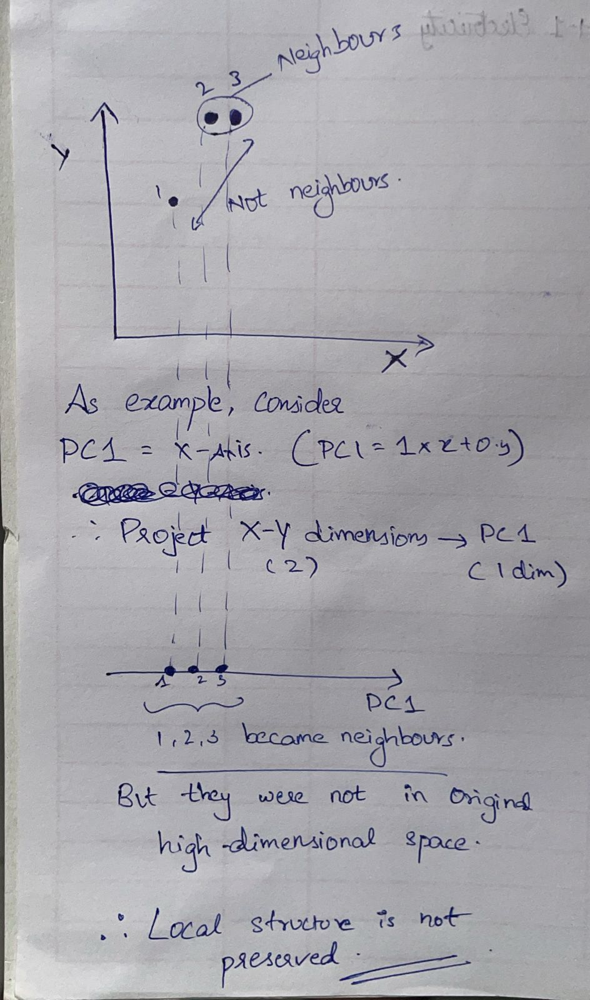
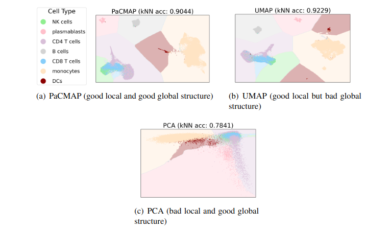

# Dimensionality Reduction (DR)

We are basically trying to **map** a point from the high-dimensional space into a low (often 2) dimensionsal space. This is dimensionality reduction. It helps you to gain insights from high-dimensional data. And there are several ways of doing that.

**Linear and Non-Linear ways**

Linear ways does this mapping through projections. This is similar to how globe is projected on a map. Different functions can do this projections.

Example: PCA

Non-linear ways does this mapping

Example: t-SNE

**Parametric and Non-Parametric ways**
In non-paramteric ways, we do not have an explicit function that does the mapping. Instead we just position points in the low dimensional space trying to optimise something (neighbours etc).

Example: tSNE, MDS

Paramteric ways - has an explicity function that does the mapping.

Example: PCA. The loadings are nothing but parameters. They are helping you map the high-dimensional space to a low dimensional space of Principal Components.

### Why do DR?
1. It enables data visualisation. Without DR, good luck visualising a dataset with 43 columns.
2. With this data visualisation, you can generate useful hypotheses.

### Global Structures vs Local Structures

Local structure preservation means that neighbors in the high-dimensional space should still be neighbors in the low-dimensional space. This is best explained by the concept -- **Homophily**

        Homophily: members of each class should be close to other members of the same class, and should be far from members of other classes. (False clusters would pass the Homophhily check)

When Homophily is failed - different classes mix together. This is what happens when we say "local structure" is not preserved. We would have less number of clusters than they actually exist.

PCA could fail to preserve local structure

Global structure preservation means that relative positions between clusters are preserved, as well as larger-scale manifold structures.

If a DR model fails to preserve global structure =>
1. False clusters (See UMAP in the figure below - brown cluster got clustered into two different clusters)
2. Distances between clusters are not preserved. So even though homophily is maintained (likes stay with likes) - the distance between clusters is very less - you cannot differentiate the clusters. This happens with t-SNE often.

[3]
PacMAP can preserve both Global and Local structures. It is a new DR model. 

### What can a bad DR model do?
1. It can show you false clusters. Meaning no actual differences between datapoints, but DR model shows them as different clusters. Then you'll bang your head trying to explore a hypothesis that explains this differentiation.
2. 

DR model outputs cannot be trusted out of the box. Should be evaulated.

### How to evaluate Dimensional Reduction methods?

See, whatever DR model you run, you'll be able to see a reduced scatter plot. How do you know if you're doing it right? The following 5 criterias will help[2]

1. Preservation of Local Structure
2. Preservation of Global Structure
3. Sensitivity to parameter choices
4. Sensitivity to pre-processing choices
5. Computational Efficiency

        Ideally, a DR method would preserve local structure and global structure, be somewhat insensitive to parameter choices and pre-processing and be computationally efficient[2]

## References

1. [Yubingen ML Lecture](https://www.youtube.com/watch?v=MnRskV3NY1k)
2. [Comprehensive evaluation of Dimensionality Reduction - Nature](https://www.nature.com/articles/s42003-022-03628-x)
3. [DR - biology - Supplementary Notes](https://static-content.springer.com/esm/art%3A10.1038%2Fs42003-022-03628-x/MediaObjects/42003_2022_3628_MOESM1_ESM.pdf)