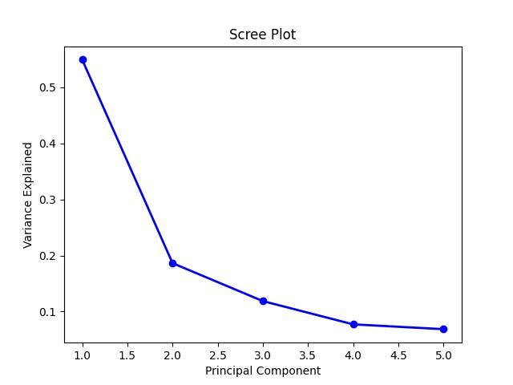

# Principal Component Analysis (PCA)

PCA 'helps'* in dimensionality reduction. You will be able to visualise 4+ dimensions (variables) in the form of a 2/3-Dimensions (Principal Components) without losing much information/variance.

* If there are 10 dimensions, you'll create 10 PCs to explain 100% variance of the original data. It is just that first 2-3 PCs can explain most of this variance and thus helps in dimension reduction.

t-SNE and MDS are other methods of this category.

## PCA Steps - Singular Value Decomposition (SVD)
1. Find the average for each variable. (x_avg, y_avg, z_avg etc...)
2. Center the graph using the above point (x_avg, y_avg ..)
3. Fit a line that passes through the centre (now, origin). Use the Squared distances method for fitting. This fitted line is PC1. Basically PC1 is the `linear combination` of variables. 
4. The slope of PC1 tells you how important each of the variable is.
5. Convert the PC1 into a `unit vector` (length=1) through scaling. This is also called the `Singular Vector` or `Eigen Vector` of PC1. And the proportions of each of the variables = `Loading Scores`. 
6. Also calculate `EigenValue` and `SingularValue` of PC1. **These are nothing but the Variance and Standard Deviation of the data projected on PC1.**
7. PC2 is the line through the origin and perpendicualr to PC1. Scale this and find unit vector, loading scores, eigen values etc.
8. Rotate the graph --> Make PC1 as X-Axis and PC2 as Y-Axis
9. Scree Plot
10. BiPlot for interpretation

## Assam Antyodaya - Cluster Villages with poor child indicators case study.
Check `pca.py`

1. We took Antyodaya 2020 data (village level) with variables that are related to children (<6 years age>). Did some feature Engineering to build a few variables as follows:

        vars = ['pct_0_3_anganwadi', 'pct_0_3_immunised',
                'pct_0_6_underweight', 'pct_0_6_anaemia', 'pct_0_6_immunised']

2. Applied MinMaxScaler - because variance is impacted by scale.

3. **Without variation, you cannot cluster**. If every village has same 50% children underweight, you can't find clusters using this variable. So, see the variation of each variable. This tells you if it is even needed.

        Variance of pct_0_3_anganwadi: 0.04
        Variance of pct_0_3_immunised: 0.13
        Variance of pct_0_6_underweight: 0.04
        Variance of pct_0_6_anaemia: 0.01
        Variance of pct_0_6_immunised: 0.03

4.  `pct_0_3_immunised` has more variance in the data than others. It would have more explanatory power.

4. PCA with 5 components (cuz 5 variables). This is the scree plot

Basically PC1 and PC2 together can explain about 74% of the variance in the data. Other PCs have less explanatory power.

6. See loadings of PC1 and PC2

7. BiPlot

We could not find visible clusters here. But there are few interpretations that can be made:

        a. There is correlation between Anganwadi registration and immunisation. This could be a causality as well? As children in Anganwadi would get immunised.

        b. Top-left villages did well on immunisation for both 0-3 and 0-6 age group. Bottom-left villages did well for 0-3, but not 0-6 age group. Why? Any lapse for 3-6 children?

## Uses of PCA:

For clustering alone, use PaCMAP as it preserves both local and global structures. But PCA can be used for other uses:

1. **Improve Machine Learning:** 

- As Principal Components explain most of the variance, they can be used in ML models instead of the variables directly. Simplifies ML modeling as a result.
- If there is multicollinearity in the original variables, the PCs will not have multicollinearity (they are orthogonal). So it might help in linear regression etc. However, the PCs are hodgepodge of original variables. So, the linear regression may not be useful for interpretation (studying affect of independent variables). But for prediction, yes it might help.

3. Image Compression.
[Reversing PCs --> Original Variables](https://stats.stackexchange.com/questions/229092/how-to-reverse-pca-and-reconstruct-original-variables-from-several-principal-com/229093#229093)

4. Outlier detection

## Limitations[3]

[Limitations - Local Structure, Non-Linearity](https://medium.com/analytics-vidhya/dimensionality-reduction-principal-component-analysis-d1402b58feb1)

## Conclusion

Use it more for data exploration. PCA provides a good data summary[2]. 

## References

1. [StatQuest](https://www.youtube.com/watch?v=FgakZw6K1QQ&t=1s)
2. [A good analogy on wines](https://stats.stackexchange.com/questions/2691/making-sense-of-principal-component-analysis-eigenvectors-eigenvalues/140579#140579)
3. [Nature Journal - PCA](https://www.nature.com/articles/nmeth.4346)