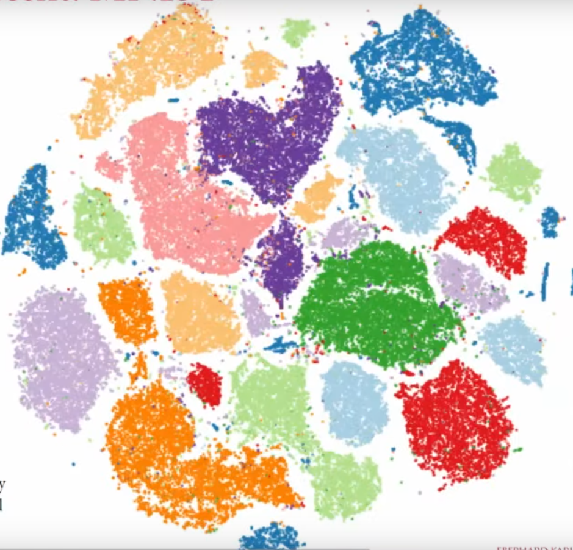
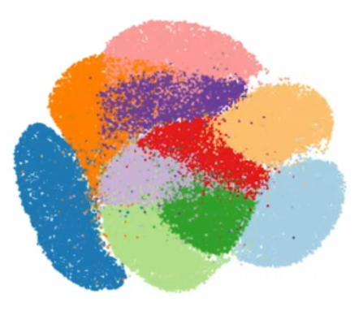

# t-SNE

**Stochastic Neighbour Embedding**

t-SNE helps in dimensionality reduction. You will be able to visualise 4+ dimensions (variables) in the form of a 2/3-Dimensions without losing much information/variance.

PCA and MDS are other methods of this category.

PCA is a Linear Approach.

## t-SNE steps
1. Determine similarity scores between all points (distances)
2. Plot the scores on a normal curve - get scaled similarity scores
3. Matrix of similarity scores
4. t-Distribution

tSNE pays **high price for putting close neighbours of HD far away in LD**. For this reason local structures are well preserved - Homophily is well maintained. Even if far neighbours of HD come close in LD, there is a price paid (this should help in Global structure preservation, but there is a problem. We'll see this next)

Math[2]

## Why tSNE fails in Global structure preservation?

A major reason where tSNE fails in Global structure preservation is by creating false clusters. But why? 

False Clusters

See closely, Homophily is still preserved. Likes are staying with likes. 

But, see the blue cluster. It got splintered. Why?

Because in the LD space, other clusters came in middle. And tSNE algorithm repels unlike groups away from each other (good thing!). So the splintered blue clusters are being repelled by the groups in the middle - not allowing them to be combined. This is a major area where tSNE often fails in preserving global structure. 

Basically this is the problem of local minima. Loss function has many local minima, so initialisation can play a large role.

**What can you do then?**
Increase the attractive force over the repuslive force. You can do thi sby playing with paramters (learning rate)

1. **Perplexity: Default 30**  
Effective number of neighbours that enter the loss function. More perplexity - more chances of global structure being preserved (because tSNE can then pay price for farther neighbours coming close). 

If perplexity is small - only information on very close neighbours is in the algorithm - Homophily is maintained (local structure). But other groups also may stay close. You can't differentiate. Crowding problem!

Crowding problem

2. Crowding problem can be addressed by using heavier tail kernels. But that would cause false clusters :| Trade-offs!

3. **Initialisation**: tSNE fails with global structure preservation basically because the loss function has a lot fo local minima. So initialisation can play large role. Instead of random initialisation, use informative initialisation - PCA can be one.

## References
1. [StatQuest](https://www.youtube.com/watch?v=NEaUSP4YerM)
2. [Tubingen ML Lecture](https://www.youtube.com/watch?v=MnRskV3NY1k)